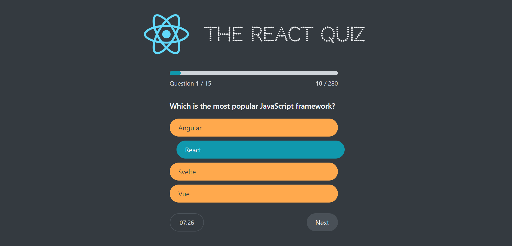

# React Quiz App

Welcome to the React Quiz App! This is a simple web application built using React that allows users to take quizzes on various topics. You can check out the live demo [here](https://react-quiz-nxtgen.netlify.app).

## Features

- Choose from a variety of quiz topics.
- Answer multiple-choice questions.
- Get instant feedback on your answers.
- Track your quiz scores.

## Demo

You can experience the app live by following this [Demo Link](https://react-quiz-nxtgen.netlify.app).

## Installation

1. Clone the repository: `git clone https://github.com/your-username/react-quiz-app.git`
2. Navigate to the project directory: `cd react-quiz-app`
3. Install dependencies: `npm install`
4. Start the development server: `npm start`

The app will be accessible at `http://localhost:3000`.

## Usage

1. Choose a quiz topic from the available options.
2. Answer the questions by selecting the appropriate choices.
3. Submit your answers and get instant feedback.
4. View your quiz scores and try different topics.

## Technologies Used

- React
- React Router
- HTML5
- CSS3

Happy quizzing! If you have any questions or feedback, feel free to contact us.
